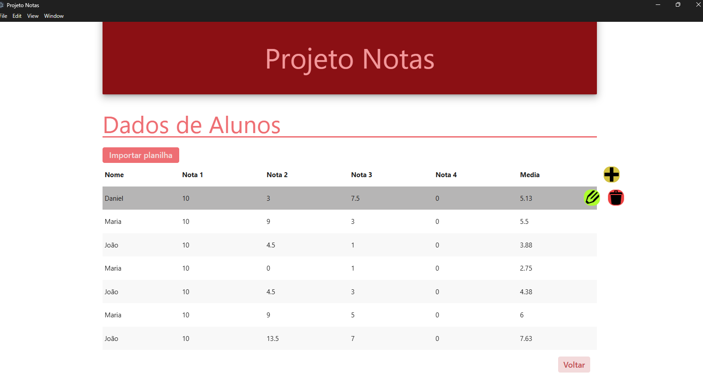

# Projeto Notas Dinâmicas

### 📝 Descrição

Tabela com listas de notas de alunos com suas respectivas médias. Projeto aprimorado com o uso de typescript para atualiar e adicionar precisão aos códigos Javascript. raliza a inserção de dados de alunos dinamicamente, fazendo o tratamento sobre notas invalidas e quantidade.

### 👀 Demonstração

#### Página principal

Uma visão da interface geral do projeto



### 💻 Tecnologias utilizadas

- HTML5
- CSS3
- JavaScript
- Typescript

### 🎯 Objetivos de aprendizado

- Praticar conceitos de tipagem estática e tipos personalizados.
- Uso de `JSON` para configurações personalizadas.
- Conceitos de loops em de tipos personalizados de objetos, uso de `Keyof`.

### 📲 Instalação

1. Clone o repositório:

```bash
git clone https://github.com/Murilo-front/Notas-Dinamicas.git meu-projeto
```

2. Acesse a pasta do projeto:

```bash
cd meu-projeto
```

3. Abra o arquivo index.html no navegador:

- Clique duas vezes no arquivo ou

- Use um editor como o Visual Studio Code e a extensão Live Server.
